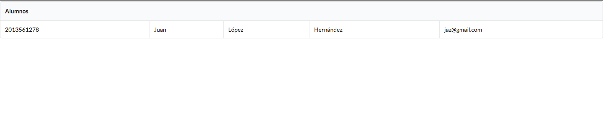

##SAES

**Descargar en Instalar:**

 * Node [**Node-js 8.1.4 or later**](https://nodejs.org/es/download/).
 * Typescript (Global) [**Typescript 2.4 or later**](http://www.typescriptlang.org/).
 
 ** Instrucciones **
 
 * Clonar este repositorio 
 
 ** Servidor **
 
 * Renombrar saes/server/.env.example a .env
 
  ```bash
 saes$ cd server
 saes/server$ npm install
 saes/server$ npm tsc
 saes/server$ npm start
 ```
 
 ** Cliente **
 
  ```bash
 saes$ cd client
 saes/client$ npm install
 saes/client$ npm run dev
 ```
 
 **Si todo salío bien abran esta ruta http://localhost:8080/#/alumnos y deberían ver esto ** 
 

 
 ## Estructura del proyecto servidor (backend) => saes/server

| Name | Description |
| ------------------------ | --------------------------------------------------------------------------------------------- |
| **dist**                 | Directorio donde se guarda el proyecto compilado                                              |
| **src**                  | Directorio que contiene el código de todo el proyecto                                         |
| **src/controllers**      | Directorio para los controladores (maneja todo lo relacionado con las peticiones)             |
| **src/models**           | Directorio que contiene los modelos de mongo db                                               |
| **src/views**            | Vistas de la aplicación hechas con pug template (Front-end)                                   |
| **src**/server.ts        | Express app                                                                                   |
| .env.example             | Variables del proyecto  (renombra => .env)                                                    |
| tsconfig.json            | Opciones de configuración para TypeScript                                                     |


## Estructura del proyecto cliente (frontend) => saes/client
**El frontend esta hecho con vue-js les puse un ejemplo de como hacer una vista y les explico los directorios y archivos más importantes, por lo general los archivos que NO se específican aquí no es necesario editarlos**

| Name | Description |
| ------------------------ | --------------------------------------------------------------------------------------------- |
| **src**                  | Directorio que contiene el código de todo el proyecto vue-js                                  |
| **src/assets**           | Directorio para imagenes en general o algún otro asset                                        |
| **src/components**       | Directorio que contiene todos los templates de vue-js (código html y JS vue-js)               |
| **src/router**/index.js  | Archivo donde se definen las rutas de lado del cliente                                        |
| **src/services**/Api.js  | Archivo principal para el consumo de api (comunicación con el servidor)                       |
| **src/services**/AlumnoService.js  | Archivo principal para hacer peticiones al servidor relacinado con Alumno (obtener, borrar, editar, agregar)           |
| index.hml                | El único html que debe haber en el proyecto                                                   |
